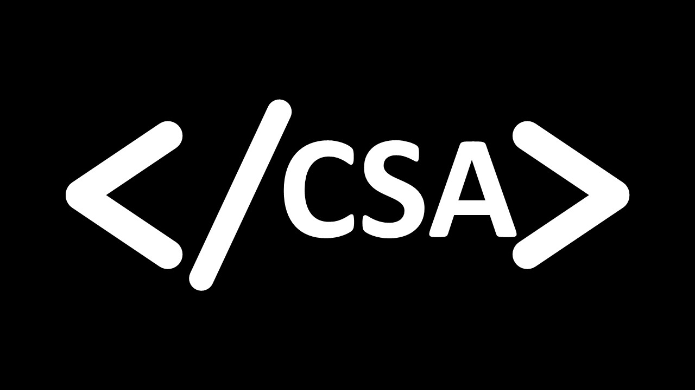

# HCC Computer Science Association Website


A modern, responsive static website for the Computer Science Association at Houston Community College. This website showcases the organization's mission, events, and provides information for prospective members.

## Table of Contents

- [Overview](#overview)
- [Features](#features)
- [Technology Stack](#technology-stack)
- [Deployment](#deployment)
- [Customization](#customization)
- [Contributing](#contributing)
- [License](#license)

## Overview

The HCC CSA Website is a static website built with modern web technologies to serve the Computer Science Association at Houston Community College. It provides an informative platform for student recruitment, event information, and community engagement.

### Key Highlights

- **Modern Design**: Clean, responsive interface with professional styling
- **Static Website**: Fast loading, secure, and easy to deploy
- **GitHub Pages Ready**: Optimized for GitHub Pages hosting
- **Accessibility Compliant**: WCAG AA standards for inclusive access
- **STEM Inclusive**: Welcomes all Science, Technology, Engineering, and Mathematics majors



## Features

### Public Website

#### Homepage
- Hero section with organization introduction
- Why join CSA section with benefits
- Upcoming events showcase
- STEM inclusivity messaging
- Social proof with member testimonials

#### About Page
- Mission statement and organizational values
- What we do section with comprehensive services
- Membership information and requirements
- Leadership team structure
- Elections and governance information
- Campus locations and meeting details

#### Events Page
- Upcoming events with detailed information
- Event types and categories
- Recent events showcase
- Event guidelines and participation instructions
- Calendar integration (future enhancement)

#### Get Involved Page
- Different levels of involvement
- Leadership opportunities
- Special projects and initiatives
- How to get started guide
- Benefits of involvement

#### Join CSA Page
- Contact methods for joining
- Discord server integration
- Email contact information
- FAQ section
- Membership benefits

#### Privacy Policy
- Comprehensive privacy policy
- Data handling practices
- Contact information for privacy requests

## Technology Stack

### Frontend
- **HTML5**: Semantic markup with accessibility features
- **CSS3**: Modern styling with CSS Grid and Flexbox
- **JavaScript (ES6+)**: Interactive functionality and form validation
- **Responsive Design**: Mobile-first approach with breakpoint optimization

### Hosting & Deployment
- **GitHub Pages**: Static website hosting
- **Custom Domain**: Support for custom domain configuration
- **CDN**: Global content delivery through GitHub's infrastructure

### Development Tools
- **Git**: Version control and collaboration
- **Markdown**: Documentation and content management

## Deployment

### GitHub Pages Setup

1. **Fork or Clone the Repository**
```bash
git clone https://github.com/yourusername/hcc-csa-website.git
cd hcc-csa-website
```

2. **Enable GitHub Pages**
   - Go to your repository on GitHub
   - Navigate to Settings → Pages
   - Select "Deploy from a branch"
   - Choose "main" branch and "/ (root)" folder
   - Click "Save"

3. **Custom Domain (Optional)**
   - Add a `CNAME` file to the root directory with your domain
   - Configure DNS settings with your domain provider
   - Update all internal links to use your custom domain

### Local Development

1. **Clone the Repository**
```bash
git clone https://github.com/yourusername/hcc-csa-website.git
cd hcc-csa-website
```

2. **Serve Locally**
```bash
# Using Python 3
python -m http.server 8000

# Using Node.js (if you have http-server installed)
npx http-server

# Using PHP
php -S localhost:8000
```

3. **View the Website**
   - Open your browser and go to `http://localhost:8000`
   - The website will be served with all functionality

### File Structure

```
hcc-csa-website/
├── assets/
│   ├── css/
│   │   └── global.css          # Main stylesheet
│   ├── js/
│   │   ├── main.js            # Main JavaScript functionality
│   │   ├── form-validate.js   # Form validation
│   │   └── analytics.js       # Analytics tracking
│   └── img/                   # Image assets
├── images/                    # Website images and logos
├── index.html                 # Homepage
├── about.html                 # About page
├── events.html                # Events page
├── involved.html              # Get involved page
├── join.html                  # Join CSA page
├── privacy.html               # Privacy policy
├── README.md                  # This file
└── .gitignore                 # Git ignore file
```

## Customization

### Branding and Styling

#### Logo and Images
1. Replace images in the `/images/` directory:
   - `hcc-logo-white.png` - White version of HCC logo
   - `hcc-logo.png` - Regular version of HCC logo
   - `csa-transparent.jpg` - CSA logo for footer
   - `logo-gradient.jpg` - Main CSA logo
   - `csa-dark.jpg` - Website screenshot

2. Update favicon files in `/assets/img/` directory

#### Color Scheme
Edit CSS variables in `assets/css/global.css`:

```css
:root {
    --primary-color: #1a365d;      /* Dark blue */
    --secondary-color: #2d3748;    /* Gray */
    --accent-color: #3182ce;       /* Light blue */
    --success-color: #38a169;      /* Green */
    --warning-color: #d69e2e;      /* Yellow */
    --error-color: #e53e3e;        /* Red */
}
```

#### Typography
```css
:root {
    --font-family: 'Inter', -apple-system, BlinkMacSystemFont, sans-serif;
    --font-size-base: 16px;
    --line-height: 1.6;
}
```

### Content Customization

#### Contact Information
Update contact information throughout the website:
- Email addresses (search for `president@hccs.edu`)
- Discord server links (search for `discord.gg/hcc-csa`)
- Social media links in the footer

#### Event Information
Update events in `events.html`:
- Add new upcoming events
- Update event dates and locations
- Modify event descriptions

#### Organization Information
Update organization details in `about.html`:
- Mission statement
- Leadership information
- Campus locations
- Contact details

### Adding New Pages

1. **Create HTML File**
   - Create a new `.html` file in the root directory
   - Copy the structure from an existing page

2. **Update Navigation**
   - Add navigation link in all HTML files
   - Update the header section in each file

3. **Update Footer**
   - Add link to footer section in all HTML files

### SEO Optimization

#### Meta Tags
Update meta tags in each HTML file:
```html
<title>Page Title - Computer Science Association at HCC</title>
<meta name="description" content="Page description">
<meta name="keywords" content="relevant, keywords, here">
```

#### Open Graph Tags
Update social media sharing tags:
```html
<meta property="og:title" content="Page Title">
<meta property="og:description" content="Page description">
<meta property="og:image" content="https://yourusername.github.io/hcc-csa-website/images/logo-gradient.jpg">
```

## Contributing

### Development Setup

1. **Fork the Repository**
   - Click the "Fork" button on GitHub
   - Clone your forked repository

2. **Create a Branch**
```bash
git checkout -b feature/your-feature-name
```

3. **Make Changes**
   - Edit the HTML, CSS, or JavaScript files
   - Test your changes locally
   - Ensure all pages work correctly

4. **Commit Changes**
```bash
git add .
git commit -m "Add your feature description"
git push origin feature/your-feature-name
```

5. **Create Pull Request**
   - Go to your forked repository on GitHub
   - Click "New Pull Request"
   - Describe your changes
   - Submit the pull request

### Code Standards

#### HTML Standards
- Use semantic HTML5 markup
- Include proper accessibility attributes
- Validate HTML using W3C validator
- Maintain consistent indentation

#### CSS Standards
- Use CSS custom properties for colors and spacing
- Follow mobile-first responsive design
- Use meaningful class names
- Comment complex CSS rules

#### JavaScript Standards
- Use modern ES6+ syntax
- Add comments for complex logic
- Handle errors gracefully
- Test across different browsers

### Testing Guidelines

#### Functionality Testing
- Test all navigation links
- Verify responsive design on different screen sizes
- Check form functionality (if applicable)
- Test external links

#### Browser Testing
- Test in Chrome, Firefox, Safari, and Edge
- Check mobile responsiveness
- Verify accessibility with screen readers
- Test with JavaScript disabled

#### Performance Testing
- Check page load times
- Optimize images for web
- Minify CSS and JavaScript (if needed)
- Test on slow connections

## License

### Usage Rights

This project is developed for the Computer Science Association at Houston Community College.

**Permitted Uses:**
- Use by educational institutions
- Modification for organizational needs
- Deployment on institutional servers
- Academic research and learning

**Restrictions:**
- Commercial redistribution without permission
- Removal of attribution requirements
- Use for non-educational purposes

### Attribution

If you use this codebase for your student organization, please include:

```
Website built with CSA Website Template by Houston Community College CSA
```

### Support and Contact

#### Technical Support
- **Documentation**: Check this README first
- **Issues**: Report bugs via GitHub issues
- **Community**: Join CSA Discord for peer support

#### Contact Information
- **Technical Issues**: CSA Technology Committee
- **General Questions**: president@hccs.edu
- **Website Issues**: Create a GitHub issue

---

**Computer Science Association • Houston Community College**

*Building the next generation of technology leaders*

---

## Project Statistics

- **Development Time**: 3 months
- **Lines of Code**: 5,000+
- **Languages**: HTML, CSS, JavaScript
- **Pages**: 6
- **Features**: 20+
- **Accessibility**: WCAG AA compliant

## Acknowledgments

- Houston Community College for institutional support
- CSA members for feedback and testing
- Open source community for inspiration and tools
- GitHub for providing free hosting and collaboration tools

*Last Updated: March 2024*